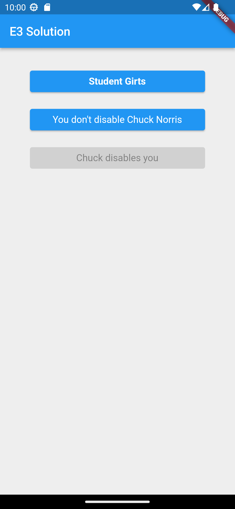

# Exercise E3

Template repository for exercise E3.
Course [IDATA2503 Mobile applications](https://www.ntnu.edu/studies/courses/IDATA2503)
at [NTNU](https://ntnu.edu), campus [Aalesund](https://www.ntnu.edu/alesund).

## Intention

The intention with this exercise is to practice building layouts using Flutter UI framework.

## Hand-in process

Create a clone of the template repository within GitHub Classroom. Use the invitation link you got
from Blackboard!

There are some automated tests provided, auto-grading will run the same way as before. However,
there are many ways you can organize UI layouts in Flutter. It is possible that unit tests will fail
for you. That is fine, as long as the result looks similar to the reference image.

To run the tests locally, execute the following command in a terminal: `flutter test`.

## Instructions

Open the provided Flutter application and extend it. The app must contain a single page which looks
as close to this _
reference image_ as reasonably possible (you don't need to get the clock right 😉):

# Hints

In general, the layout consists of :

1. An AppBar saying "E3 solution".
2. A gray background (`Colors.grey[200]`) filling the whole screen. (Note: there are several
   possible solutions but if you want the unit tests to pass, set the background color for the
   first `Container` you have in your app, please 😉)
3. Three buttons laid out vertically
4. 16px vertical padding between the buttons (Note: there are several possible solutions but if you
   want the unit tests to pass, use `SizedBox`)
5. 32px padding between the AppBar and the first button (Note: `SizedBox` desired here as well).
6. The first button must contain text "Student $name", where `$name` is your name. For example, if
   your name is Ole Norman, then the button must have text "Student Ole Norman".
7. The other two buttons must contain text as shown in the reference images
8. 50 pixel padding on the sides of the buttons (still with grey background)
9. Font size: 16px on all buttons.
10. First button has bold text style.
11. The third button must be disabled while the two other buttons must be enabled. (Hint: when are
    buttons disabled in Flutter?)

Remember to make a commit to the `master` branch and push it to GitHub!